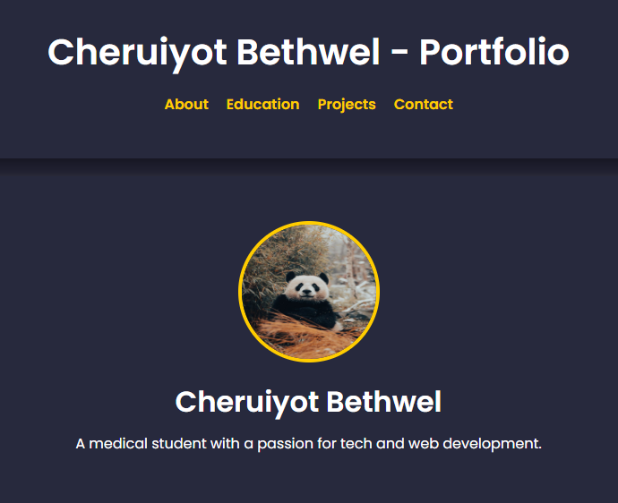

# Portfolio Website

## 🚀 Live Demo
You can view my live portfolio website [here](https://cbethwel.netlify.app/).

## 📸 Screenshot


## 📝 About

Hi! I'm **Cheruiyot Bethwel**, a passionate web developer currently studying medicine at the University of Nairobi. I specialize in creating modern, responsive websites that provide an exceptional user experience. I’m constantly learning and exploring new technologies to enhance my skills in web development.

## 🎓 Education

- **Bachelor of Medicine and Bachelor of Surgery**  
  University of Nairobi, 2018–2025

## 🛠️ Technologies Used

- HTML5
- CSS3
- JavaScript
- Git
- GitHub
- Netlify

## 💡 Projects

- **Portfolio Website:**  
  A fully responsive portfolio site showcasing my development skills and passion for creating interactive web experiences.  
  [View Project](https://fancy-bonbon-efe075.netlify.app/)  

- **Projects Coming Soon**  
  I am currently working on various projects to showcase here. If you would like to request a preview of my work or learn more about my progress, feel free to reach out!  
  [Request Project Preview](mailto:cheruiyotbethwel11095@gmail.com?subject=Request%20Project%20Preview&body=Hello%2C%0D%0A%0D%0AI%20would%20like%20to%20request%20a%20preview%20of%20your%20projects%20and%20learn%20more%20about%20your%20work.%20Please%20let%20me%20know%20how%20I%20can%20view%20or%20explore%20your%20projects.%0D%0A%0D%0AThank%20you!)

## 📬 Contact

Feel free to reach out to me if you have any questions or opportunities to collaborate!

- 📧 **Email:** [cheruiyotbethwel11095@gmail.com](mailto:cheruiyotbethwel11095@gmail.com)
- 🔗 **LinkedIn:** [Request LinkedIn Profile](mailto:cheruiyotbethwel11095@gmail.com?subject=Request%20LinkedIn%20Profile&body=Hello%2C%0D%0A%0D%0AI'm%20interested%20in%20connecting%20with%20you%20on%20LinkedIn.%20Please%20let%20me%20know%20if%20you%20can%20share%20your%20LinkedIn%20profile%20with%20me.%0D%0A%0D%0AThank%20you!)

## 💡 Future Plans

- Add more projects as I build and enhance my skills.
- Continuously update this portfolio to reflect my growth as a web developer and future professional.

---

### How To Run The Project Locally:

1. Clone the repository:
   ```bash
   git clone https://github.com/cbethwel/PLP-Hackathon-1.git
   ```

2. Navigate to the project directory:
   ```bash
   cd PLP-Hackathon-1
   ```

3. Open the `index.html` file in your browser to view the portfolio locally.

---

### 👤 Created by:  
Cheruiyot Bethwel
